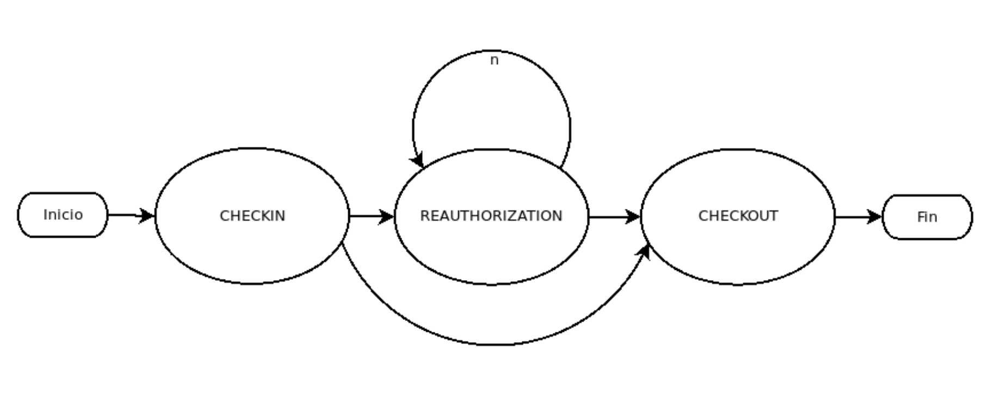

# Tipos de transacciones

## Autorización
Una autorización hace referencia al proceso que se ejecuta luego de que el usuario ingresa la información solicitada y ésta es enviada a la red para realizar el cobro.

## Pago Recurrente
Es un cobro periódico realizado por PlacetoPay para un mismo valor con un intervalo (diario, mensual, anual) según la indicación dada en la petición.

Para hacer uso de esta funcionalidad, en la estructura payment del Pago recurrente es necesario enviar en el objeto recurring los datos obligatorios para esta estructura.

## Pre-autorización
Este tipo de transacciones son usadas con el fin de reservar (checkin) un monto de dinero sobre una tarjeta de crédito para posteriormente hacer el débito del mismo (checkout). Este monto en el transcurso del tiempo puede cambiar (reauthorization) según las necesidades del comercio o cambios en los servicios elegidos por el tarjetahabiente.

## Check-In
La  transacción tipo CHECKIN es  utilizada  para  obtener  una  autorización por  parte  del  banco (proveedor). Esta se define como: Realizar un débito a una tarjeta de crédito/débito el cual se utiliza como depósito de garantía por la utilización de un bien o servicio.



### Solicitud Checkin (Request)

Para permitir una rápida integración por parte de los comercios, las solicitudes de este tipo son similares a las descritas metodo `processTransaction` con algunas diferencias mencionadas a continuación:

- Verificar la “action” igual a “checkin”.
- La  referencia del  pago  usada  aquí  se  usará  también  en  las  REAUTHORIZATION  y CHECKOUT posteriores.
- La moneda del pago usada aquí se usará también en las REAUTHORIZATION y CHECKOUT posteriores.
- No  se tendrán  en  cuenta los detalles  sobre  dispersión  en  la solicitud.  (Múltiples transacciones a diferentes recaudadores con la misma información del tarjetahabiente).
- No se tendrán en cuenta los detalles de recurrencia en la solicitud. (Cobros recurrentes desde una base de datos propietaria).

IMPORTANTE: Poner especial atención al nodo: “preAuthorization”, estos son los datos con los que se usarán en las posteriores operaciones de REAUTORIZACION y CHECKOUT. Además está sección muestra el estado general del proceso de preautorización.

## Re-Autorización

```json
No aplica a Puerto Rico
```

La transacción tipo REAUTHORIZATION es utilizada modificar el monto definido como depósito de garantía separado previamente con una transacción tipo CHECKIN. Esto realiza una nueva autorización (reautorización) por parte del banco (proveedor).

### Solicitud Reautorización (Request)

Es necesario hacer primero una solicitud CHECKIN para procesar una REAUTORIZACION ya que:

- La referencia del pago para los casos de REAUTHORIZATION es sobreescrita por la sesión CHECKIN original
- La moneda del pago para los casos de REAUTHORIZATION es sobreescrita por la sesión CHECKIN original
- Los datos usados en el “internalReference” y “authorization”de la solicitud corresponden a los datos entregados por en la respuesta de CHECKIN en el nodo “preAuthorization”
- Es posible hacer n (varias) REAUTHORIZATION, desde luego, todas antes de la operación de CHECKOUT
- Las reautorizaciones siempre deben ser por un valor mayor 0


Para resaltar que después de esta operación el proceso de preautorización sigue en estado pendiente, esto se debe a que sigue la espera de una operación de CHECKOUT.

## Check-out

La transacción tipo CHECKOUT es utilizada confirmar el monto del depósito de garantía separado previamente con una transacción tipo CHECKIN/REAUTHORIZATION. Esto formaliza la transacción (compra/asentamiento) en el (proveedor).


### Solicitud Checkout (Request)

Según esta definición, dentro de Evertec este tipo de transacciones:

- Se puede hacer un CHECKOUT sin tener que hacer un REAUTORIZACION
- La referencia del pago para los casos de CHECKOUT es sobreescrita por la sesión CHECKIN original
- La moneda del pago para los casos de CHECKOUT es sobreescrita por la sesión CHECKIN original
- Los datos usados en el “internalReference” y “authorization” corresponden  a  los  datos entregados por el proceso de CHECKIN en el nodo “preAuthorization”
- Si  el  valor  del  CHECKOUT  es  0,  la  preautorización  es  cancelada  y  se  libera  el  monto retenido en las peticiones previas

IMPORTANTE: Notar que el "status”, “authorization” y “receipt” del nodo “preAuthorization” cambia con durante un CHECKOUT exitoso, por lo cual, en las peticiones de REVERSE, se deben usar estos nuevos valores en la petición.
